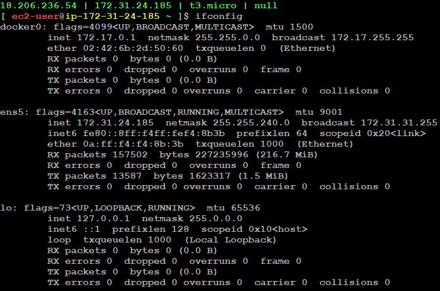

## Docker Networking
**Home Network**

* Here, Internet Service Provider (ISP) will provide internet to home router.
*  one external and one internai IPs to the router. Outside of our home is external IP and inside our home is internal IP
ISP provides `public IP address` (External) and `private IP address` (Internal) to the router. External IP address will be accessed from outside of home and internal IP address will be accessed internally inside home
* So, here router provides IP addresses to laptops and mobiles and Internet Service provider (ISP) provides IP address for router 
* In general, internal IP address range will be like `192.168.1.0`
* For, every laptop there will be an interface like Wi-Fi, Ethernet etc., If we connect through Ethernet we will get one IP Address and if we connect through Wi-Fi we will get another IP address. 
* If we turn-off Wi-Fi and connect to mobile network, then SIM provider will provide the IP Address

**Docker Network**

If we check the network interfaces on the system using `ifconfig`, we will get different network interfaces on a Linux system like `docker0`, `ens5`, and `lo`

**1. docker0** `Virtual bridge for Docker containers to communicate with each other and the host`

**Type:** 
* Virtual Network Interface

**Description:** 
* Here, docker creates seperate virtual network interface i.e., `docker0`
* `docker0` provides ip address to the containers which is called `bridge network`
* It allows containers to communicate with each other and with the host system
* It acts as modem to the containers inside VM
* Containers connected to this bridge can access the internet through the host's network. 

**2. ens5** `Physical or virtual interface used for external network communication`

**Type:** 
Physical or Virtual Network Interface 

**Description:** 
Every VM's will get internet access through Ethernet from AWS ISP. Here, `ens5` is the network provided by AWS ISP

**3. lo (Loopback)** `Loopback interface for internal communication within the host`

**Type:** 
Virtual Network Interface

**Description:**
The loopback interface is a special virtual interface used for internal communication within the host 
