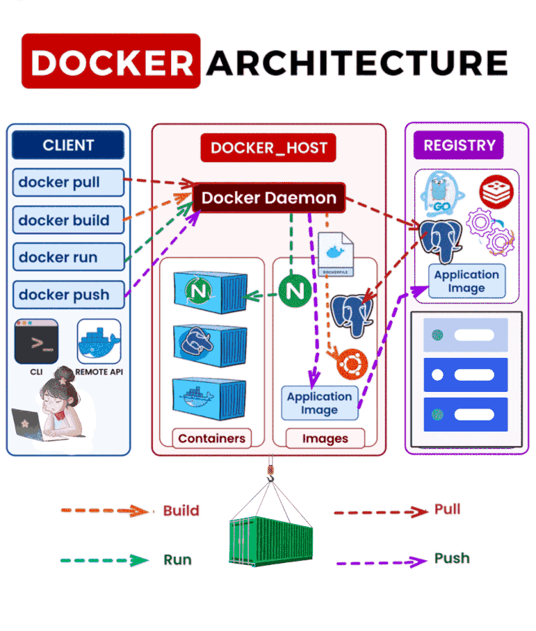

## Docker Archietcture

Docker is a platform that makes it easier to create, deploy, and run applications using containers. Containers are lightweight, standalone, and executable units that contain everything needed to run a piece of software: code, runtime, system tools, libraries, and settings.

Unlike virtual machines (VMs), containers share the host system’s operating system, making them faster and more efficient in resource usage.

**Key Components of Docker Architecture:**
Docker’s architecture has several key components that work together to manage containers. Here’s a closer look at each part:

- **Docker Client**  
 The Docker Client is the interface that users interact with. Whenever you type a Docker command (docker run, docker build, etc.), the client communicates with the Docker Daemon to perform actions like building, starting, or stopping containers.

- **Docker Daemon (dockerd)**  
 The Docker Daemon is the backbone of Docker. It runs in the background and manages Docker objects like images, containers, networks, and volumes. It listens for Docker API requests and handles the heavy lifting, like creating and managing containers.

- **Docker Image**  
 A Docker Image is a blueprint for a container. It’s a read-only template that contains instructions on how to create a container. Think of it as a snapshot of an application at a specific point in time. For example, if you want to run a Python app, you’ll use a Docker image that includes Python, the app code, and any dependencies needed.

- **Docker Container**  
 A Docker Container is a runnable instance of a Docker Image. When you run an image, Docker creates a container that contains everything the application needs to run. Containers are isolated from one another, but they share the same host OS, which makes them lightweight and fast.

- **Docker Registry**  
 Docker Registry is a place where Docker Images are stored. The most popular registry is Docker Hub, but you can also set up your own private registry. When you pull an image (download it) or push an image (upload it), Docker interacts with the registry.

- **Dockerfile**  
 A Dockerfile is a simple text file that contains a series of instructions for building a Docker Image. It tells Docker how to set up the environment inside the container. For example, you can specify which base image to use, what software packages to install, and what command to run when the container starts.

**How Docker Works?**
- `Docker client` is nothing but a docker command. 
- `Docker Host/Daemon` defines that docker service is running
    - `docker run -d -p 80:80 nginx`
- When we give docker command, it will connect to docker daemon. 
- Then docker daemon checks whether image exist local or not, if exist it will run. 
- If not exist, it will pull from docker registry/hub. Then, it will create a container out of it and runs it and sends the output to the client 

**Advantages of Docker:**  
- **Portability:**  
 Docker containers run the same way in any environment, making it easy to move applications from development to production.
- **Efficiency:**  
 Containers are lightweight and share the host OS, reducing overhead and making them faster than traditional VMs.
- **Scalability:**  
 Docker integrates well with tools like Kubernetes, making it easier to scale applications across multiple servers.

**Disadvantages of Docker:**  
- There is no reliability since there is only one docker host 
- There is no autoscaling 
- There is no load balancing 
- Volumes are inside docker host -> poor volume management 
- No secret management --> no security 
- No communication between containers or in another docker host -> network management is not good 

so, due to these disadvantages, Orchestration comes into picture 